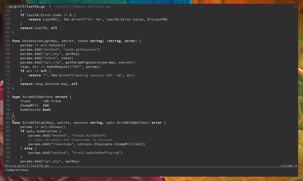

# vim-print-debug



automatic "printf" style debugging for vim.  
each new call returns a unique line with incrementing chars. eg "aaa", "bbb", "ccc".  

it also leaves the print statements in a format where it's easy to add some variable interpolation.  

this plugin is only for extreme professionals 😎

## install

with your favourite plugin manager, `sentriz/vim-print-debug`.  
or just copy the source into your vimrc.

and add a mapping:
```vim
nnoremap <leader>p :call print_debug#print_debug()<cr>
```

## settings

#### `g:print_debug_default` 

  - desc: template to use if no language was found
  - default:
```vim
let g:print_debug_default = '"{}"'
```

#### `g:print_debug_templates` 

  - desc: debug line templates for different filetypes. (see `:echo &filetype`)
  - default:
```vim
let g:print_debug_templates = {
\   'go':         'fmt.Printf("+++ {}\n")',
\   'python':     'print(f"+++ {}")',
\   'javascript': 'console.log(`+++ {}`);',
\   'c':          'printf("+++ {}\n");',
\ }
```
